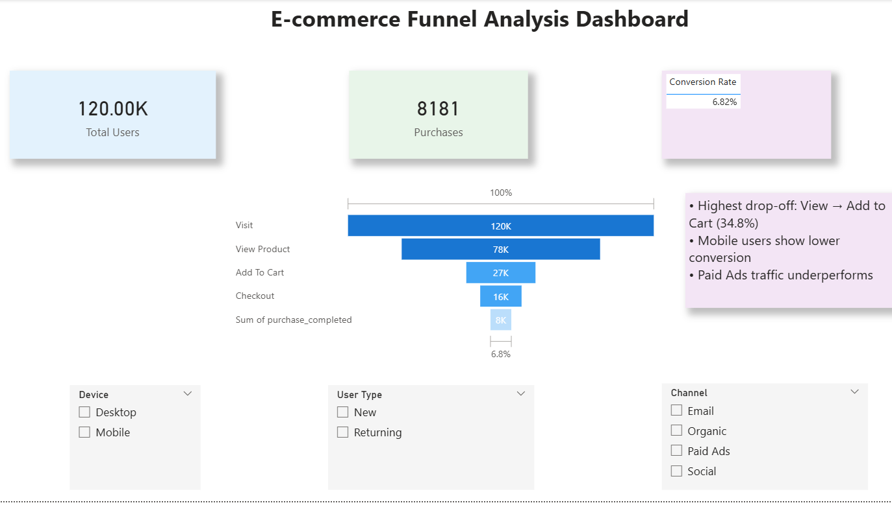

# 📊 E-commerce Funnel Analysis Dashboard

## 🔍 Project Overview
This project analyzes user behavior across an e-commerce funnel to identify drop-offs and improve conversion rates.

## 🎯 Objective
To understand where users drop off in the funnel and suggest improvements.

## 🧩 Funnel Stages
Visit → Product View → Add to Cart → Checkout → Purchase

## 📈 Key Insights
- Highest drop-off at View → Add to Cart (34.8%)
- Mobile users show lower conversion
- Paid Ads traffic underperforms

## 🛠️ Tools Used
- Power BI
- Python (Pandas)
- Power Query

## 📊 Dashboard

## 💡 Recommendations
- Improve mobile UX
- Optimize ad targeting
- Enhance product pages
